<picture>
  <source media="(prefers-color-scheme: dark)" srcset="assets/hero-dark.svg">
  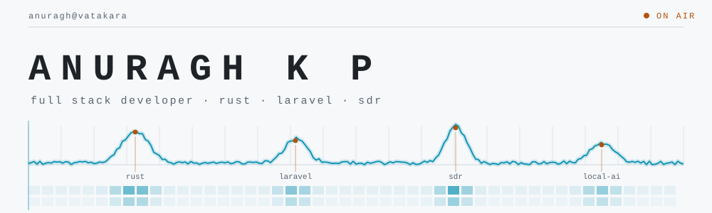
</picture>

I build web applications for a living — Laravel and Node, mostly. That is the
part of the job that pays. The part that keeps me interested is what happens
when I hit the bottom of an abstraction and decide to keep going: an OS in
Assembly, DEFLATE reimplemented from scratch, a Wayland notification daemon
written to spec, a debugger bridge that speaks DBGp on the wire.

The other habit is that when a tool annoys me I rebuild it rather than filing an
issue. Most of what is below started that way.

And on evenings, radio — pointing a software-defined receiver at the sky and
decoding whatever falls out of it. Receive only; I am not licensed to transmit.

<picture>
  <source media="(prefers-color-scheme: dark)" srcset="assets/hdr-the-pattern-dark.svg">
  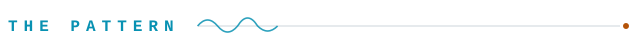
</picture>

Most people stop at the framework. I keep going, and the projects below are where
I stopped instead.

<picture>
  <source media="(prefers-color-scheme: dark)" srcset="assets/layers-dark.svg">
  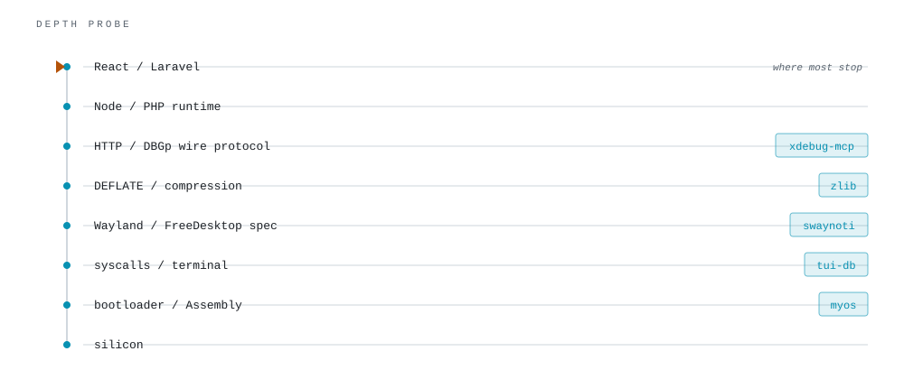
</picture>

<picture>
  <source media="(prefers-color-scheme: dark)" srcset="assets/hdr-on-air-dark.svg">
  
</picture>

| Project | | |
|---|---|---|
| **[noted](https://github.com/kpanuragh/noted)** | `Rust` | A self-hostable notes workspace that builds a knowledge graph out of your own writing. It pulls entities and relations from your notes, clusters them into themes, and answers questions against the graph — so it can reach a note through a chain of ideas rather than a keyword match. Local embeddings, no API key. |
| **[gitlab_logger](https://github.com/kpanuragh/gitlab_logger)** | `Go` | Ships GitLab projects, pipelines and full job traces into Loki, so CI history stays searchable in Grafana long after GitLab's retention has thrown it out. |
| **[ollama-tui](https://github.com/kpanuragh/ollama-tui)** | `Rust` | A terminal chat client for local Ollama models with real modal editing — normal, insert, command and visual. Streaming responses, SQLite-backed sessions, no mouse. |
| **[iamanuragh.in](https://github.com/kpanuragh/kpanuragh.github.io)** | `TypeScript` | The blog. Mostly Laravel and Rust, occasionally a post about something that took me three days and should have taken twenty minutes. |

<picture>
  <source media="(prefers-color-scheme: dark)" srcset="assets/hdr-workshop-dark.svg">
  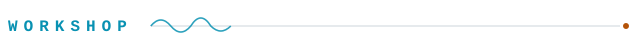
</picture>

<picture>
  <source media="(prefers-color-scheme: dark)" srcset="assets/workshop-dark.svg">
  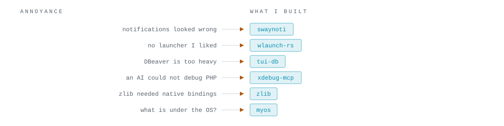
</picture>

<picture>
  <source media="(prefers-color-scheme: dark)" srcset="assets/hdr-strong-signals-dark.svg">
  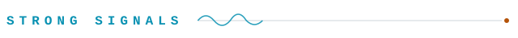
</picture>

**[xdebug-mcp](https://github.com/kpanuragh/xdebug-mcp)** · `TypeScript` · ★ 24 
An MCP server for PHP Xdebug. It lets an AI assistant actually step through your
code — breakpoints, stack frames, variable inspection — over Unix socket or TCP,
instead of guessing at the bug from a stack trace.

**[zlib](https://github.com/kpanuragh/zlib)** · `JavaScript` · ★ 20 
Node's zlib core module reimplemented in pure JavaScript. Gzip and
Deflate/Inflate with no native bindings to compile.

**[tui-db](https://github.com/kpanuragh/tui-db)** · `Rust` 
DBeaver without leaving the terminal. Browse schemas, scroll a 124-column table
sideways, all of it vim-bound.

**[swaynoti](https://github.com/kpanuragh/swaynoti)** · `Rust` 
A notification daemon for Wayland implementing the full FreeDesktop spec. I
wanted my notifications to look a particular way and this was, on reflection, the
proportionate response.

**[wlaunch-rs](https://github.com/kpanuragh/wlaunch-rs)** · `Rust` 
A Raycast-style launcher for Linux, built on Iced. See above, regarding
proportionate responses.

**[ssh-mcp](https://github.com/kpanuragh/ssh-mcp)** · `TypeScript` · ★ 2 
An MCP server that gives an assistant a real SSH session on a remote host.

**[php_dockerize](https://github.com/kpanuragh/php_dockerize)** · `Shell` · ★ 3 
One script that stands up a complete PHP stack in Docker, written after doing it
by hand for the fifteenth time.

Also: **[dbexplore.nvim](https://github.com/kpanuragh/dbexplore.nvim)** (databases
inside Neovim) · **[chroma_viewer](https://github.com/kpanuragh/chroma_viewer)**
(poke around a Chroma vector store) ·
**[syncs](https://github.com/kpanuragh/syncs)** (`Rust`)

<picture>
  <source media="(prefers-color-scheme: dark)" srcset="assets/hdr-upstream-dark.svg">
  
</picture>

| Project | | |
|---|---|---|
| **[Alexays/Waybar](https://github.com/Alexays/Waybar)** | ★ 11.7k | The Wayland bar that half of Linux runs. Taught the Image module to take its path from an executable, so the bar can show something that changes. |
| **[NativePHP/electron](https://github.com/NativePHP/electron)** | ★ 515 | The Electron backend that lets PHP ship as a desktop app. Repaired the `electron-builder` configuration. |
| **[IamThejus/Gravity-Music](https://github.com/IamThejus/Gravity-Music)** | | Four rounds on a Flutter music app: brought it to the Linux desktop with audio and MPRIS, packaged it for `.deb`, `.rpm`, APK and MSIX, built a taste-aware recommender with per-artist and discovery mixes, and added karaoke lyric modes. |

<picture>
  <source media="(prefers-color-scheme: dark)" srcset="assets/hdr-noise-floor-dark.svg">
  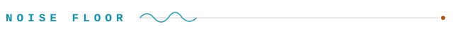
</picture>

<table>
<tr>
<td width="330">
<picture>
  <source media="(prefers-color-scheme: dark)" srcset="assets/radar-dark.svg">
  
</picture>
</td>
<td>

**Radio and SDR.** Pointing a software-defined receiver at the sky and decoding
whatever falls out of it — aircraft transponders, weather, the occasional
satellite — while beating Morse into my head one Koch drill at a time. Receive
only: I am not licensed to transmit, and listening is most of the fun anyway.

</td>
</tr>
</table>

- **[myos](https://github.com/kpanuragh/myos).** An operating system, in
  Assembly, from nothing. At some point you have to find out what is actually
  down there.
- **A desktop assembled from parts.** Gentoo, Hyprland, Neovim, and a dotfiles
  repo rewritten more often than any product I have shipped —
  [nixos](https://github.com/kpanuragh/nixos),
  [ubuntu_nix_hyprland](https://github.com/kpanuragh/ubuntu_nix_hyprland),
  [dotfiles](https://github.com/kpanuragh/dotfiles) form the archaeological
  record.
- **Hundred-day challenges.**
  [100_days_rust](https://github.com/kpanuragh/100_days_rust) and
  [100days_of_ai](https://github.com/kpanuragh/100days_of_ai). I keep starting
  them. Do not ask which day I am on.

<picture>
  <source media="(prefers-color-scheme: dark)" srcset="assets/hdr-band-plan-dark.svg">
  
</picture>

<picture>
  <source media="(prefers-color-scheme: dark)" srcset="assets/band-plan-dark.svg">
  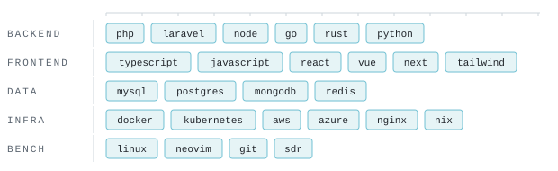
</picture>

<picture>
  <source media="(prefers-color-scheme: dark)" srcset="assets/hdr-bench-dark.svg">
  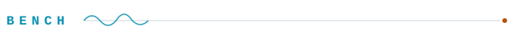
</picture>

<picture>
  <source media="(prefers-color-scheme: dark)" srcset="assets/terminal-dark.svg">
  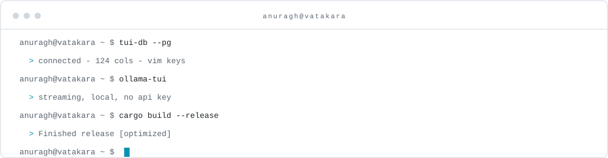
</picture>

<picture>
  <source media="(prefers-color-scheme: dark)" srcset="assets/hdr-telemetry-dark.svg">
  
</picture>

<picture>
  <source media="(prefers-color-scheme: dark)" srcset="assets/stats-dark.svg">
  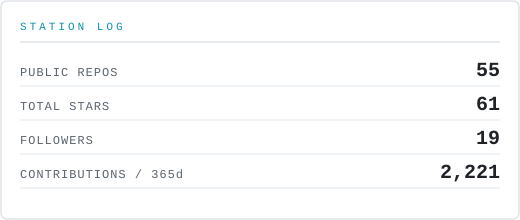
</picture>
<picture>
  <source media="(prefers-color-scheme: dark)" srcset="assets/spectrum-dark.svg">
  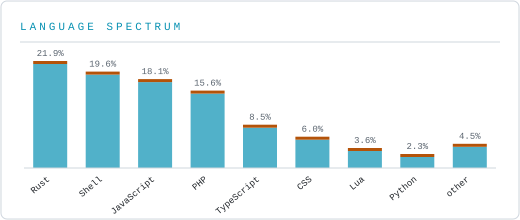
</picture>

Regenerated nightly by a GitHub Action in this repository — no third-party
image services involved.

<picture>
  <source media="(prefers-color-scheme: dark)" srcset="assets/hdr-contact-dark.svg">
  
</picture>

[iamanuragh.in](https://iamanuragh.in/) ·
[@anuragh_kp](https://twitter.com/anuragh_kp) ·
[LinkedIn](https://linkedin.com/in/anuraghkp) ·
[Stack Overflow](https://stackoverflow.com/users/9456940) ·
[kpanuragh@gmail.com](mailto:kpanuragh@gmail.com)

Still debugging with <code>console.log()</code>. Still not sorry.
